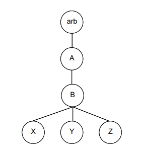

# ProcesosUNIX_C
En este programa escrito en C se genera el siguiente árbol de procesos:

Se utiliza memoria compartida para imprimir por pantalla los pid de los distintos procesos

Además, el programa requiere de 2 parámetros o argumentos: el proceso Z pasados los segundos indicados por el segundo argumento le ordenará mediante una señal al proceso indicado por el primer parámetro (A, B, X, Y) que ejecute otra orden (si el parámetro es A o B, ejecutará el comando "pstree", mientras que si el parámetro es X o Y ejecutará el comando "ls").
